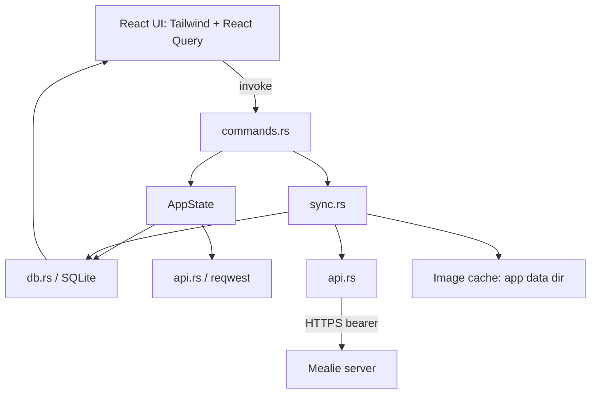

# Requirements

### Overview & Goals
Build **RustyMeals**, a Tauri 2.0 (Rust core + React/TypeScript frontend) offline-first Android client for a self-hosted Mealie instance (`https://bicknellfamily.duckdns.org:9925`). The app must let a user browse, search, and read recipes reliably even with no connectivity, solving the offline gap in Mealie's PWA.

The repo today is a bare Rust binary (`Cargo.toml` edition 2024 + `src/main.rs` hello-world). This plan scaffolds the full app from scratch.

**Scope for this plan: Phase 1 (core plumbing) + Phase 2 (real UI).** Offline hardening and release/ship (Phases 3–4) are out of scope here.

### Scope
**In Scope**
- Standard Tauri 2.0 project layout with Android build target.
- Rust core: Mealie REST API client, SQLite local cache, image cache, sync engine, Tauri IPC commands.
- Authentication supporting **both** a username/password login flow and a pasted long-lived API token.
- React UI: login/settings, recipe list (search + thumbnails + tags), recipe detail (ingredients/steps/image), per-recipe "mark offline" toggle, read-only shopping list view.
- Styling with **Tailwind**, server-state via **React Query** wrapping `invoke()`.

**Out of Scope (this plan)**
- Phase 3 offline hardening (airplane-mode QA pass, background resume sync, cache cleanup/retry robustness).
- Phase 4 polish/ship (icon, theming, signed release APK, distribution, iOS build).
- Editing recipes or shopping lists on the server (read-mostly v1).
- Multi-account switching UI (single active account per app instance; login is re-runnable).

### User Stories
- As a user, I want to log in with my Mealie username/password **or** paste an API token, so I can connect however suits me.
- As a user, I want to browse and search my recipe list with thumbnails and tags, so I can find recipes quickly.
- As a user, I want to open a recipe and see its ingredients, steps, and image, so I can cook from it.
- As a user, I want to flag a recipe as "available offline" so its full body + image are downloaded and readable with no network.
- As a user, I want a settings screen with server URL, login/logout, and a manual "Sync Now" button, so I control refreshes.
- As a user, I want a read-only view of my shopping lists.

### Functional Requirements
- The React UI **never** calls Mealie directly; all network + persistence goes through Rust Tauri commands, and the UI always reads from SQLite.
- On login, pull the recipe metadata list (id/slug, name, description, thumbnail, tags) into SQLite so browsing/search works immediately.
- Marking a recipe offline downloads its full payload + image to SQLite + the app image dir; unmarking is allowed.
- "Sync Now" re-pulls the metadata list plus every recipe flagged offline; last-sync-wins on conflicts.
- Search/filter over cached recipe name and tags happens against local SQLite data.
- Auth token is persisted securely (Tauri secure-storage / keyring plugin), never in plain SQLite.

### Non-Functional Requirements
- Offline reads must succeed with zero network (deterministic SQLite reads).
- TLS: standard `reqwest`/http validation (Let's Encrypt cert on server — no pinning needed).
- Same codebase must remain iOS-capable later (Tauri 2.0 mobile), so avoid Android-only assumptions in Rust core.

# Technical Design

### Current Implementation
- `Cargo.toml`: package `RustyMeals`, edition 2024, **no dependencies**.
- `src/main.rs`: a 4-line hello-world.
No Tauri, frontend, SQLite, or HTTP code exists yet — this is a greenfield scaffold.

### Key Decisions
- **Project layout:** adopt the **standard Tauri layout** — move the Rust core into `src-tauri/`, put the Vite/React app at repo root. This is what `tauri`/mobile tooling (`cargo tauri android init/dev`) expects.
- **Rust core structure:** **layered modules** — `api`, `db`, `sync`, `commands`, `state` — for clear separation of concerns and future growth.
- **Auth:** support **both** username/password login (exchange for token via Mealie `POST /api/auth/token`) and a manually pasted long-lived API token. Both resolve to a bearer token stored securely.
- **Frontend state:** **Tailwind** for styling, **React Query** (TanStack) wrapping `invoke()` for caching/loading/error states.
- **Data storage:** `raw_json` blob + a few denormalized columns (name/tags/image_path) so we don't mirror Mealie's full schema.

### Proposed Changes
Scaffold a Tauri 2.0 mobile app and implement the full Rust ⇄ React ⇄ SQLite ⇄ Mealie loop, then build the real UI.

**Rust core (`src-tauri/src/`):**
- `state.rs` — `AppState { db: Mutex<Connection> (or r2d2 pool), http: reqwest::Client, auth: Mutex<Option<AuthCtx>> }`, plus app-data-dir path for the image cache.
- `db.rs` — rusqlite (bundled feature) connection init + migrations creating `recipes`, `shopping_lists`, `sync_meta`; CRUD helpers for recipe summaries/detail and offline flag.
- `api.rs` — Mealie REST client: `login(server, user, pass)`, list recipes (`GET /api/recipes`), get recipe (`GET /api/recipes/{slug}`), get shopping lists, download image; serde models for payloads.
- `sync.rs` — sync engine: metadata pull, per-recipe full pull + image download, `sync_now` orchestration returning a `SyncReport`.
- `commands.rs` — Tauri IPC commands (contract below).
- `lib.rs`/`main.rs` — Tauri builder registering the secure-storage/keyring plugin, `AppState`, and command handlers; mobile entry point.

**Frontend (repo root):** Vite + React + TS + Tailwind + React Query; a thin `src/api/tauri.ts` wrapping `invoke()`; screens for login/settings, recipe list, recipe detail, shopping lists.

### Data Models / Contracts
SQLite schema (as specified in the task):
```sql
CREATE TABLE recipes (id TEXT PRIMARY KEY, name TEXT NOT NULL, description TEXT,
  image_path TEXT, raw_json TEXT NOT NULL, tags TEXT,
  marked_offline INTEGER DEFAULT 0, last_synced_at INTEGER);
CREATE TABLE shopping_lists (id TEXT PRIMARY KEY, name TEXT NOT NULL,
  raw_json TEXT NOT NULL, last_synced_at INTEGER);
CREATE TABLE sync_meta (key TEXT PRIMARY KEY, value TEXT);
```
Tauri command contract:
```rust
#[tauri::command] async fn login(server_url: String, username: Option<String>, password: Option<String>, api_token: Option<String>, state: State<'_, AppState>) -> Result<(), String>
#[tauri::command] async fn logout(state: State<'_, AppState>) -> Result<(), String>
#[tauri::command] async fn get_recipes(query: Option<String>, state: State<'_, AppState>) -> Result<Vec<RecipeSummary>, String>
#[tauri::command] async fn get_recipe(id: String, state: State<'_, AppState>) -> Result<Recipe, String>
#[tauri::command] async fn set_offline_available(id: String, offline: bool, state: State<'_, AppState>) -> Result<(), String>
#[tauri::command] async fn sync_now(state: State<'_, AppState>) -> Result<SyncReport, String>
#[tauri::command] async fn get_shopping_lists(state: State<'_, AppState>) -> Result<Vec<ShoppingList>, String>
```
`login` accepts either credentials or a token (mutually exclusive) to satisfy the "support both" decision.

### File Structure
```
/ (repo root)
  package.json, vite.config.ts, tailwind.config.js, index.html
  src/                 # React app
    api/tauri.ts
    screens/{Login,RecipeList,RecipeDetail,ShoppingLists,Settings}.tsx
    components/, main.tsx
  src-tauri/
    Cargo.toml, tauri.conf.json, build.rs
    src/{main.rs,lib.rs,state.rs,db.rs,api.rs,sync.rs,commands.rs}
    gen/android/        # created by `cargo tauri android init`
```
The existing root `Cargo.toml` + `src/main.rs` are superseded by the Tauri scaffold.

### Architecture Diagram


### Risks
- **Tauri mobile toolchain setup** (Android SDK/NDK, rust targets) is environment-dependent; the Android scaffold step may need local prerequisites.
- **Mealie API shape/pagination**: `GET /api/recipes` is paginated — the client must follow pages; token endpoint path/format must match the server version.
- **rusqlite on Android**: use the `bundled` feature so no system SQLite dependency is required on device.
- **Secure storage on mobile**: confirm the chosen keyring/secure-storage plugin supports Android; fall back to Tauri store if needed.

# Testing

### Validation Approach
Validate bottom-up: Rust unit tests for pure logic, `cargo build`/`cargo check` for the core, `tsc` + `vite build` for the frontend, and a manual end-to-end loop against the live Mealie server for the IPC path.

### Key Scenarios
- DB migration creates all three tables on a fresh SQLite file.
- `login` with username/password stores a bearer token; `login` with a pasted API token also works.
- `get_recipes` returns cached summaries after an initial sync and filters by `query` against name/tags.
- `get_recipe` returns full detail from `raw_json` for a synced recipe.
- `set_offline_available(id, true)` downloads the image to the app dir and sets `image_path` + `marked_offline`.
- `sync_now` refreshes metadata and re-pulls offline-flagged recipes, returning a `SyncReport`.
- Recipe list, detail, offline toggle, and shopping list screens render and reflect Rust responses.

### Edge Cases
- Offline read: with the network disabled, list/detail for offline-marked recipes still render from SQLite.
- Auth failure / expired token surfaces a readable error to the UI (Result<_, String>).
- Missing/oversized recipe image download fails gracefully without breaking the detail view.
- Paginated recipe lists are fully retrieved (no truncation at the first page).

### Test Changes
- Add Rust `#[cfg(test)]` unit tests for `db.rs` (migration + CRUD against an in-memory SQLite) and serde model (de)serialization in `api.rs`.
- Frontend: type-check and build as the smoke test; add a lightweight test for the `tauri.ts` wrapper if a test runner is introduced.

# Delivery Steps

### * Step 1: Scaffold Tauri 2.0 project with standard layout and Android target
A buildable Tauri 2.0 skeleton exists in the standard layout, with the Rust core in `src-tauri/` and a Vite/React/TS app at the repo root.

- Restructure the repo: move Rust into `src-tauri/` and initialize the Tauri app (`tauri.conf.json`, `build.rs`, `src-tauri/Cargo.toml` with `tauri`, `reqwest`, `rusqlite` bundled, `serde`, `serde_json`, `tokio`, secure-storage/keyring plugin).
- Scaffold the frontend at root: Vite + React + TypeScript + Tailwind + React Query (`package.json`, `vite.config.ts`, `tailwind.config.js`, `index.html`, `src/main.tsx`).
- Wire the Android target: document/prepare `cargo tauri android init`, rust Android targets, and `ANDROID_HOME`/`NDK_HOME` expectations.
- Verify with `cargo check` in `src-tauri` and `vite build` / `tsc` on the frontend.

###   Step 2: Implement Rust data layer, AppState, and Mealie API client
The Rust core can authenticate to Mealie, fetch recipe/shopping-list data, and persist it to a local SQLite cache.

- Add `state.rs` with `AppState` holding the SQLite connection, `reqwest::Client`, secure-stored auth token, and app-data-dir path.
- Add `db.rs`: connection init + migrations creating `recipes`, `shopping_lists`, `sync_meta`, plus CRUD helpers for summaries, detail, and the offline flag.
- Add `api.rs`: Mealie REST client (token login via `POST /api/auth/token`, pasted-token support, `GET /api/recipes` with pagination, `GET /api/recipes/{slug}`, shopping lists, image download) with serde models.
- Add unit tests for migrations/CRUD (in-memory SQLite) and serde (de)serialization.

###   Step 3: Implement sync engine, image cache, and Tauri IPC commands
All Rust ⇄ React commands work end-to-end, and offline-flagged recipes download their full body + image locally.

- Add `sync.rs`: metadata pull on login, per-recipe full pull + image download into the app data dir, and `sync_now` orchestration returning a `SyncReport`.
- Add `commands.rs` implementing `login` (credentials OR api_token), `logout`, `get_recipes(query)`, `get_recipe`, `set_offline_available`, `sync_now`, `get_shopping_lists`.
- Register `AppState`, the secure-storage plugin, and all commands in `lib.rs`/`main.rs` (mobile entry point).
- Ensure auth tokens are stored via secure storage, never in plain SQLite.

###   Step 4: Build React foundation: auth/settings and IPC wrapper
The frontend can connect to Mealie and trigger syncs through a typed IPC layer.

- Add `src/api/tauri.ts` wrapping `invoke()` with typed functions for every command, integrated with React Query.
- Build the Login screen supporting both username/password and pasted API-token flows, calling `login`.
- Build the Settings screen: server URL, login/logout, manual "Sync Now" button wired to `sync_now`.
- Add app shell/navigation and Tailwind base styling.

###   Step 5: Build recipe and shopping-list UI with offline toggle
The user can browse, search, read recipes, mark them offline, and view shopping lists — all reading from the Rust/SQLite cache.

- Recipe List screen: search box, thumbnails, tags, and a visible offline-available indicator, backed by `get_recipes(query)`.
- Recipe Detail screen: ingredients, steps, and image via `get_recipe`, with a "Mark offline" toggle calling `set_offline_available`.
- Shopping Lists screen: read-only rendering via `get_shopping_lists`.
- Handle loading/empty/error states through React Query so cached data renders even when offline.